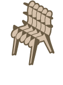
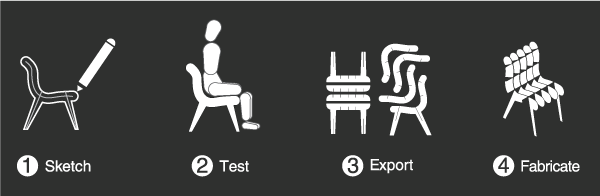

<p align="center">
  
</p>

# SketchChair

**Design and fabricate your own digitally fabricated furniture**

<p align="center">
  
</p>

SketchChair is an open-source software tool that allows anyone to easily design and build their own digitally fabricated furniture. Sketch your design, test it with an ergonomic figure, and generate cutting patterns for CNC fabrication - all within minutes.

**By:** [Diatom Studio](http://diatom.cc)
**Contact:** hello@diatom.cc
**Website:** [sketchchair.cc](http://sketchchair.cc)

---

## Quick Start

### Building

```bash
# Clean and compile
ant clean compile

# Build JAR
ant build.standard

# Your compiled application will be in: build/SketchChair-standard.jar
```

### Running

#### macOS (recommended):
```bash
./launch-mac.command
```

#### Other platforms:
```bash
cd build
java -Djogamp.gluegen.UseTempJarCache=true -jar SketchChair-standard.jar
```

---

## Documentation

Detailed JavaDoc documentation for all custom classes can be found at: `/doc/index.html`

Additional documentation:
- **[build-windows.md](build-windows.md)** - Windows-specific build instructions
- **[release-instructions.md](release-instructions.md)** - Creating release packages
- **[processing4-upgrade.md](processing4-upgrade.md)** - Processing 4 migration notes

---

## How It Works

This is a high-level overview of the SketchChair engine:

### 1. **Sketch**
SketchChair contains a vector drawing program. When you draw on a SketchPlane, drawings are managed by the `cc.sketchchair.sketch` package.

### 2. **Build & Calculate**
The build command generates all parametric parts of your design:

- The engine examines slice selections added by the user
- The `cc.sketchchair.geometry` package calculates chair slice forms based on intersections between SketchPlanes
- Additional SketchPlanes are added with slots so pieces fit together
- Multiple slice styles are supported: flat finger-jointed surfaces, waffle forms, etc.

### 3. **3D Simulation**
- Drawings from multiple SketchPlanes combine to create cutting outlines with joining details
- Outlines generate 3D meshes fed to the jBullet physics engine
- Simulation calculates chair position and ergonomic figure interaction
- SketchPlanes are matched to the physically simulated model and rendered

### 4. **Pattern Generation & Export**
When producing a design:
- SketchOutlines are generated and passed to the ShapePacking package
- Pieces are automatically packed on sheets of specified size
- Export through ToolPathWriter package in various formats (DXF, G-code, PDF, etc.)

### 5. **Save & Share**
- Designs save using SketchChair's custom DOM format
- Each element recursively saves via `toXML()` methods
- CloudHook package handles uploading to sketchchair.cc
- Server compares designs to create/update database entries

---

## Code Structure

SketchChair is organized into modular packages that can be used independently:

### Core Packages

#### `cc.sketchchair.core`
Core SketchChair application code. Ties together geometry, shape packing, and figure libraries.

#### `cc.sketchchair.geometry`
Geometry classes for storing design structure and calculating cross slices and slots.

#### `cc.sketchchair.sketch`
Drawing functions and classes. Can function as a standalone vector drawing program.

#### `cc.sketchchair.functions`
Miscellaneous static utility functions.

#### `cc.sketchchair.ragdoll`
Ergonomic figure for testing chair designs.

### Additional Packages

#### `cc.sketchchair.environments`
2D textures for reference backgrounds on drawing planes.

#### `cc.sketchchair.sketch.gui`
GUI assets and components.

#### `cc.sketchchair.triangulate`
Delaunay triangulation library for generating 3D meshes from design outlines.

#### `cc.sketchchair.widgets`
GUI widgets: layer selector, slice settings, etc.

### Custom Libraries

#### `CloudHook`
Server communication for uploading chairs and user authentication. Server component written in PHP.

#### `ModalGUI`
Custom GUI library with standard components written for SketchChair.

#### `ShapePacking`
2D cutting outline packing onto material sheets.

#### `ToolPathWriter`
Converts 2D sketch outlines to output formats: G-code, DXF, PDF, etc.

---

## Technology Stack

### Language
**Java** with the [Processing](http://processing.org) framework

This provides:
- Cross-platform compatibility (Windows, macOS, Linux)
- Potential for web deployment via ProcessingJS/p5.js

### Third-Party Libraries

#### Processing 4.3
- **Homepage:** http://processing.org/
- **License:** LGPL
- **Note:** SketchChair uses a patched `core.jar` with custom application icons to fix the macOS Dock icon issue with JOGL's NEWT windowing system (see Processing Issue #5123). The original is backed up as `core.jar.BACKUP` in `libProcessing4/`.

#### JOGL 2.x (JOGL, GLUEGEN)
- **Homepage:** http://jogamp.org/
- **Purpose:** OpenGL bindings for Java
- **Version:** 2.6.0 (latest stable, compatible with macOS 15.3+ and Apple Silicon)

#### jBullet
- **Homepage:** http://jbullet.advel.cz/
- **License:** ZLIB
- **Purpose:** Physics simulation

#### ToxicLibs
- **Homepage:** http://toxiclibs.org/
- **License:** LGPLv2
- **Purpose:** Geometry utilities

#### SVG Salamander
- **Homepage:** http://svgsalamander.java.net/
- **License:** LGPL
- **Purpose:** SVG import/export

#### XOM
- **Homepage:** http://www.xom.nu/
- **License:** LGPL
- **Purpose:** XML processing

---

## Development

### IDE
SketchChair was originally developed using Eclipse IDE.

### Build System
Apache Ant (see `build.xml`)

### Java Version
- **Current:** Java 17+
- **Recommended for macOS 15.3+:** JDK 25 (for JOGL 2.6.0 compatibility)

---

## Legacy Mode (Deprecated)

**Note:** Legacy mode (Processing 1.x) is no longer maintained in current development branches.

<details>
<summary>Legacy compilation instructions (for reference only)</summary>

### To compile in legacy mode:

1. Edit `src/SETTINGS.java` - Change line 106: `LEGACY_MODE = true;`
2. Edit `build.xml`:
   - Change line 14: `dir="libLegacy"`
   - Change line 69: `dir="libLegacy"`
3. Run: `ant build`

### To compile in current mode:

1. Edit `src/SETTINGS.java` - Change line 106: `LEGACY_MODE = false;`
2. Edit `build.xml`:
   - Change line 14: `dir="libCurrent"`
   - Change line 69: `dir="libCurrent"`
3. Run: `ant build`

</details>

---

## Contributing

SketchChair is open-source and welcomes contributions!

- **Issues & Features:** [GitHub Issues](https://github.com/diatom/SketchChair/issues)
- **Documentation:** See `/doc/index.html` for API docs
- **Questions:** hello@diatom.cc

---

## License

See [LICENSE.txt](LICENSE.txt) for full license information.

---

## Links

- **Website:** [sketchchair.cc](http://sketchchair.cc)
- **Studio:** [diatom.cc](http://diatom.cc)
- **Processing:** [processing.org](http://processing.org)

---

<p align="center">
  Made with ❤️ by Diatom Studio
</p>
